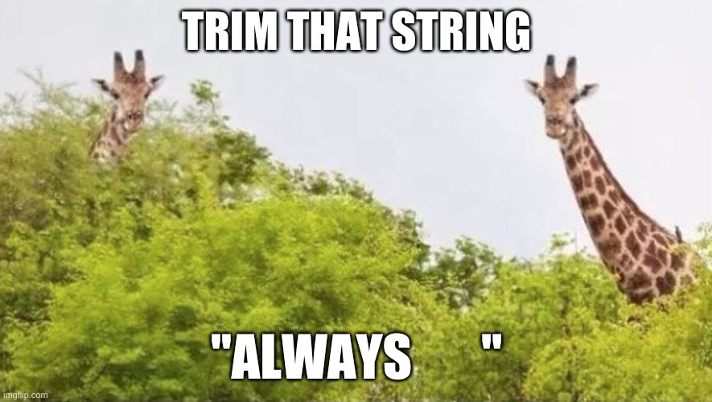

# John's Quotes {-}

:::{.quote}
```{=html}
<blockquote style='border:none'>&ldquo;Push forward and hard.&rdquo; </br><strong>John Zobolas</strong></blockquote>
```
:::



> Trim that string. Always.

> Nothing is statistically significant anymore!

> There are no weekends.

> To learn the Art of Programming you *need* to learn the Art of Debugging first

> In the DrugLogics group we don’t do research. 
We do *badass* research

---

> Something is better than nothing.

> Act. Don't think.

> Everything manifests in *variation*.
The spectrum of variation ranges from complete order (no variation, oneness, stability) to complete disorder (infinite variation, diversity, chaos).
Yin and Yang.
It seems to me that somewhere between lies the meaning of life.
Hard to get the golden path!

> So you had a nice sleep. No wonder, it was dead quiet!

My comment to a doctor I was collaborating with, who was explaining to me where he normally sleeps for his night shift (near to a cancer patient section) and how nice and quiet it is there!

